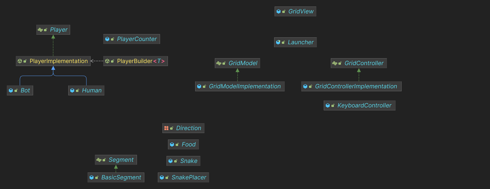

# [CPOO5] Compléments en Programmation Orientée Objet, Projet : Serpents

## Dépendances

```txt
$ java --version
openjdk 17.0.9 2023-10-17
OpenJDK Runtime Environment Temurin-17.0.9+9 (build 17.0.9+9)
OpenJDK 64-Bit Server VM Temurin-17.0.9+9 (build 17.0.9+9, mixed mode, sharing)
```

Nous avons utilisé `Gradle` pour gérer les dépendances et le projet, ce projet contient donc une configuration gradle (`build.gradle`, `settings.gradle`).

La configuration gradle contient les déclarations de toutes les dépendances restantes nécessaires pour le projet, ainsi que des définitions de tâches. Notamment :

- `./gradlew run` : lance le jeu dans une fenêtre graphique.
- `./gradlem test` : lance les tests du projet qui ont été effectués à l'aide de `JUnit5` et `Mockito` (définis dans `src/test/java`). Vous pourrez lire le rapport généré dans le fichier `build/reports/tests/test/index.html`.

## Description

Par manque de temps, nous n'avons pas pu réaliser le projet en entier.

Nous avons donc décidé de réaliser les parties suivantes :
- 1: déplacement d’un seul segment
- 2: IA
- 3: déplacement d'un serpent
- 4: gestion de la gestion de la mort
- 5: gestion de la croissance

## Architecture

### Tests

Nous avons fait en sorte de tester rigoureusement notre code à l'aide de `Junit5` et `Mockito`.

Les tests se trouvent dans le dossier `src/test/java`.

### Implémentation

#### Diagramme de `main`



Le `Launcher` se trouve à la racine du projet et sert à initialiser le MVC pour lancer le jeu via la commande `./gradlew run`.

Concernant l'architecture du projet, nous avons décidé d'opter pour le design MVC (Model-View-Controller) que nous avons séparés en 3 packages : `model`, `view` et `controller`.

Nous avons essayé d'appliquer au mieux les notions apprises lors du Semestre 5,
vous trouverez donc des utilisations de Builder Pattern, de généricité, de "programmation à l'interface", etc...

#### Model

Le package `model` se charge de la gestion des données du jeu et de la logique.

Il contient les packages et classes suivants :

- `Direction`: Enumération des directions possibles, unité de pas, composantes de mouvement.
- `food`: gestion de la nourriture avec `Food`
- `grid`: gestion de la grille du jeu et de ses éléments avec `GridModel` et `GridModelImplementation`
- `player`: gestion des joueurs avec `Player`, `PlayerBuilder`, `PlayerImplmentation`, `Bot`, `Human` et `PlayerCounter`
- `segment`: gestion des segments avec `Segment` et `BasicSegment`
- `snake`: gestion des serpents avec `Snake`, `Snake.Builder` et `SnakePlacer`
 
#### View

Le package `view.grid` se charge de l'affichage du jeu.

- `GridView`: Se charge de l'affichage de la grille du jeu et de son contenu.

#### Controller

Le package `controller` se charge de la gestion des évènements du jeu ainsi que de sa logique.

- `grid`: gestion des évènements de la grille avec `GridController` et `GridControllerImplementation`
- `KeyboardController` gestion des évènements des joueurs pour les déplacements

## Auteurs

Ce projet a été réalisé par le binôme 17:
- GUETTEVILLE Nathan
- SOAN Tony Ly
 
## Dépôt Git

Le dépôt git du projet se trouve à l'adresse suivante : https://github.com/GitFenixZ/slither